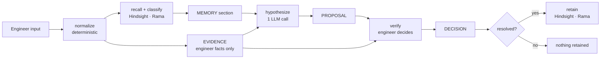

# Phase 1 — What Is Implemented

**Date:** 2026-09-28 · **Code:** `integration/phase1` @ `1f29c30` plus `mukul/phase1-fixes` (8 commits, pending
Rama's review) · **Tests:** 235 offline (8 more run only against live Hindsight) · **Size:** ~3,200 lines of
Python in `src/`, standard library plus `hindsight-client`.

A command-line debugging assistant for a single engineer. It recalls past debugging cases from
Hindsight, proposes hypotheses with one LLM call, makes the engineer verify them against current
evidence, and retains the verified outcome, including what failed, for the next similar issue.

```
MEMORY informs · EVIDENCE verifies · AGENT proposes · ENGINEER decides
```

## 1. The loop



One session, in order: **normalize** the issue → **recall** similar past cases and classify them
(relevant / partial / contradictory / irrelevant / stale, or abstain) → collect **current evidence**
from the engineer → **one structured LLM call** proposes 2–3 ranked hypotheses that may cite only
recalled cases → the engineer **verifies** each against current evidence and decides → the engineer
**resolves** → the case is **retained** only if a resolution was reported.

## 2. Components

| Module | Owner | Responsibility |
|---|---|---|
| `schemas.py` | Rama | `MemoryCase` (10 required fields), `RecallResult`, `RecallSet`, `MatchReport`, `AbstentionDecision`, `RetentionDecision`; fail-closed validation |
| `memory/hindsight_store.py` | Rama | Hindsight Cloud retain/recall; per-case dedupe (joins all of a case's facts); verbatim metadata for environment and failed approaches; idempotency ledger; bank provisioning; `close()` |
| `memory/matching.py` | Rama | `classify_candidates`: relevance classes, app-side abstention with a reason, contradiction surfacing (paraphrase-aware, limited to services named in the query) |
| `seeds/` | Rama | 6 cases in the service/API runtime-failure domain + idempotent loader |
| `config.py` | Rama | Hindsight settings and provisional thresholds from the environment |
| `pipeline/types.py` | Mukul | `DebugInput`, `NormalizedDebugCase`, `Evidence`, `Hypothesis`, `VerificationResult`, `Resolution` |
| `pipeline/memory_port.py` | Mukul | The seam: `MemoryPort` interface, `MemoryFailure`, boundary checks on every view and retention decision |
| `pipeline/memory_adapter.py` | Rama (MK9) | Rama's store + `classify_candidates` behind the port; case text/outcome join; error mapping; drops `"unknown"` placeholders |
| `pipeline/normalize.py` | Mukul | Deterministic normalizer; reads `service/runtime/proxy/region` as whole tokens from the description and measurements; conflicts fail closed |
| `pipeline/recall_match.py` | Mukul | One recall per session; which cases may be cited; past-vs-current environment comparison |
| `pipeline/evidence.py` | Mukul | Current evidence from the engineer only (source, time, known/unknown); no path for recalled content |
| `pipeline/hypothesize.py` | Mukul | Prompt that separates CURRENT ISSUE from PAST CASES; response schema; citation check; `relevance_state` set by code |
| `pipeline/verify.py` | Mukul | Verification gate (missing evidence ⇒ `insufficient_evidence`, however strong the memory); resolution; contradicted accepted hypotheses become failed approaches |
| `pipeline/investigate.py` | Mukul | Runs the session; builds the `MemoryCase`; calls `retain()` only after decisions and a resolution |
| `pipeline/render.py` | Mukul | MEMORY / EVIDENCE / PROPOSAL / DECISION / RETENTION sections; scores never shown |
| `llm/router.py` | Mukul | Baseten primary → OpenRouter fallback; per-provider reasoning control; local schema validation; retry and failover rules |
| `cli.py` | Mukul | `debug` (interactive) and `inspect`; one-line errors; closes the memory port |
| `mk0/probe.py` | Mukul | Runtime verification of both providers against the real response contract |

## 3. Trust rules and where they are enforced

| Rule | Enforced by |
|---|---|
| Memory never becomes evidence | `evidence.py` has no input for recalled content; tests assert recalled text never appears in `Evidence` |
| A hypothesis cites only recalled, citable cases | Citation check inside the LLM call: an invented id is retried, then failed over, never returned |
| The model never labels its own trust level | `relevance_state` derived in code from the cited cases' classes |
| `generic` ⇔ no citations | `Hypothesis.from_dict` rejects either violation |
| Missing evidence stays unverified | `verify.py`: a known-unknown field the cited case depends on ⇒ `insufficient_evidence`, even if the engineer claims support |
| The engineer decides | Every hypothesis needs a decision; `VerificationResult` cannot exist without one |
| Only verified outcomes are retained | `retain()` only after decisions **and** a reported resolution; unknown environment values dropped |
| Memory failure is never "no memory" | `MemoryFailure` kinds (`unavailable`, `auth`, `schema`) reach the engineer as one-line errors |
| LLM failure is never "nothing found" | `LLMAuthError`, `LLMConfigError`, `LLMUnavailable`, `StructuredOutputError`; unvalidated text is never returned |

## 4. LLM layer (measured in MK0, `docs/phase1-mukul-m0-plan.md`)

| Setting | Value | Why |
|---|---|---|
| Primary | Baseten DeepSeek V4.1 Flash, strict schema, `thinking: false` | p50 3.2 s, 5/5 valid on the real contract |
| Fallback | OpenRouter Space Bunny Alpha, schema hint, `reasoning.effort: low` | Rejects strict routing (404); valid once reasoning is controlled |
| `max_tokens` | 1500 | Without reasoning control both models spent 3000 tokens reasoning and returned no JSON |
| Timeouts | primary 10 s, fallback 17 s | 1.5 × max observed |
| Failover | timeout, unreachable, 429, 5xx, 200-with-error | Never on 400/401/402/403/404 |
| Invalid output | retry the same route once → fall back (same one retry) → raise | The fallback was seen adding a `rank` field or returning a bare list |

## 5. Verification

| Check | Result |
|---|---|
| Offline suites | **235 pass** (8 live-only tests skip offline) |
| Rama's live Hindsight tests (trial bank) | 7 / 7 |
| Rama's fresh-bank rehearsal (`integration/phase1`) | Acts 1–3 passed once; documented in `docs/phase1-demo-scenario.md` |
| Mukul's fresh-bank dry runs (`mukul/phase1-fixes`, Mac, real LLM + Hindsight) | Act 1 abstains and retains; Act 2 memory-backed, leads with the recorded fix, shows *"Failed before"*; Act 3 shows both conflicting cases; **Act 4** (Act 1 recurs) recalls and cites the case retained live minutes earlier |
| Failure paths | Primary down → fallback serves, `fallback_used=True`; bad key → one-line auth error, no failover; Hindsight 504 → one-line `memory unavailable`, nothing retained |
| Second-domain probe (Rama, synthetic VLSI) | Trust boundary held (no memory in Evidence, citations tied to recalled ids, memory never used as proof); retrieval limits found (see §6) |

## 6. Known limitations of Phase 1

| # | Limitation | Effect | Phase 2 item |
|---|---|---|---|
| L1 | Thresholds are provisional (`min_final_score 0.05`, `semantic_floor 0.70`, …) | The semantic fallback admits unrelated cases (payments-api for an upload issue; unrelated VLSI memories) | Calibration |
| L2 | Contradiction abstention depends on one score margin | Act 3 abstained on 0 of 5 fresh banks; both sides are always shown | Conflict redesign |
| L3 | Contradictory cases are still citable when memory does not abstain | Hypotheses can cite one side (labelled "past cases disagree") | Citation gating |
| L4 | Environment metadata keys are fixed (`service, runtime, proxy, region`) | Other domains lose their context (VLSI node, PVT corner, tool, stage) | Domain-neutral metadata |
| L5 | Hindsight fact extraction varies per bank | Scores and extracted facts differ between fresh banks | Calibration + evaluation harness |
| L6 | `update()` / `invalidate()` do not work on `hindsight-client 0.10.1` | Cases cannot be corrected or retired | Curation via REST |
| L7 | ~25 prompts per session | Heavy for an engineer; hides the idea in a demo | Slim input (Phase 1 P0 #4) |
| L8 | Idempotency ledger is local and keyed without the bank id | A new bank needs a new ledger directory | Ledger keyed on bank id |
| L9 | Seeds are synthetic | Weaker "realistic data" story | Realistic seed write-ups |

## 7. How to run

```fish
python3 -m pip install "hindsight-client==0.10.1"
# .env.live: LLM_PRIMARY_*/LLM_FALLBACK_* keys, HINDSIGHT_URL, HINDSIGHT_API_KEY
set -x HINDSIGHT_BANK_ID demo-(date +%s)                    # fresh bank for a recording
set -x DEBUGAGENT_DATA_DIR /tmp/demo-ledger-$HINDSIGHT_BANK_ID  # and a fresh ledger
env PYTHONPATH=src python3 -c "from debugagent.config import load_memory_config; from debugagent.memory.hindsight_store import HindsightMemoryStore; from debugagent.seeds.loader import load_seed_cases; s = HindsightMemoryStore(load_memory_config()); print(load_seed_cases(s).to_dict()); s.close()"
env PYTHONPATH=src python3 -m debugagent.cli debug           # one session
env PYTHONPATH=src python3 -m debugagent.cli inspect         # trace of the last session
env PYTHONPATH=src python3 -m unittest discover -s tests     # offline tests
```

## 8. Branches

| Branch | Contents |
|---|---|
| `integration/phase1` | Rama's validated integration (MK9) of both sides; the demo branch |
| `mukul/phase1-fixes` | 8 commits on top: dedupe, verbatim metadata, adapter placeholders, fallback robustness, CLI input, one-line errors, demo script, improvement plan |
| `mukul-loop` | Mukul's layered refactor (controllers / services / domain / ports / adapters / views + architecture test), not yet integrated |
| `rama-m0` | Rama's memory layer before integration |
